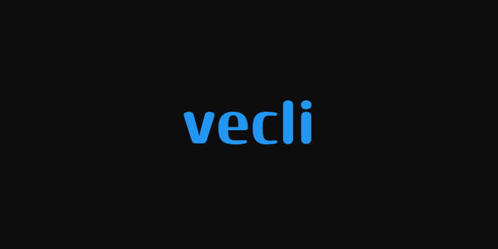
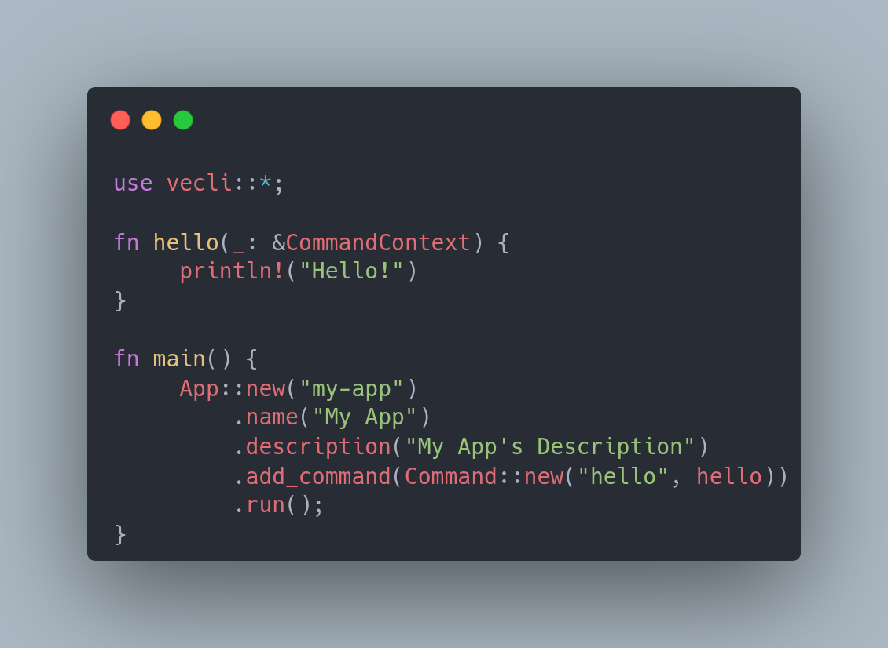

<div align="center">



**A zero-dep, minimal CLI framework that's genuinely readable.**

[](./LICENSE.md)
[](https://docs.rs/vecli)

[](https://crates.io/crates/vecli)
[](https://github.com/razkar-studio/vecli/releases)
[](https://razkar-studio.github.io/vecli/)

</div>

---

> [!WARNING]
> vecli is currently in an unstable state, regarding its status as a new crate. The API is subject to change and the crate is experimental.
> I do not recommend using it in production.

## What is vecli?
vecli is a zero-dep CLI framework made in Rust with UX in mind, and makes development of CLI tools easy and straightforward.

Do you want to make a minimal CLI app but don't want a billion dependencies or doing all by yourself?
Then vecli is perfect for you! If not? You're at the wrong place.

**Zero dependencies, minimal, but easy to use and powerful.** A great way to start learning to build CLI tools in Rust.

## Features

- Zero dependencies. Compiles instantly, minimal to zero bloat
- Subcommands as plain functions via a clean handler pattern
- Built-in `--help` and `--version` with no configuration required
- Per-command help with usage strings and flag listings
- Short flag aliases with automatic resolution to canonical names
- Global flags available across all commands
- App-level strict flag mode
- Main entry point for REPL-style usage
- Interactive prompts built in: `Terminal`, `Confirm`, and `Choice`

## Documentation
The API reference is [here](https://docs.rs/vecli).

> [!NOTE]
> The user guide is under construction. Expect the bare minimum for knowing vecli.

The user guide is [here](https://razkar-studio.github.io/vecli/).

# Usage



Let's create your first CLI tool using vecli.

Create a new Rust project and add vecli as a dependency. More details [here](#installation)

Open `main.rs` and add the following code:

```rust
use vecli::*;

fn hello(_: &CommandContext) {
     println!("Hello!")
}

fn main() {
     App::new("my-app")
         .name("My App")
         .description("My App's Description")
         .add_command(Command::new("hello", hello))
         .run();
}
```

Run `cargo run hello`, and you should see `Hello!` printed to the console.
Congrats, you've created your first CLI tool using vecli! Really, it's *that* easy.

> [!NOTE]
> For more details and features unseen in this README, check the [documentation](https://docs.rs/vecli), or the [user guide](https://razkar-studio.github.io/vecli/).

# Installation
To install vecli as a dependency, run the following command on your cargo project:

```sh
cargo add vecli
```

or alternatively, add the following to your `Cargo.toml` file:

```toml
[dependencies]
vecli = "0.2"
```

## Examples

The [GitHub repository](https://github.com/razkar-studio/vecli) contains an example CLI tool built using vecli. Clone the repository and try it out for yourself using `cargo run --example taskr`.

# License
This project is protected by the RazkarStudio Permissive License, a permissive source license with limitations to AI/ML training use. See [LICENSE.md](LICENSE.md) for more information.

# Contributing
Contributions are welcome! Please open an issue or submit a pull request on the [GitHub repository](https://github.com/razkar-studio/vecli).

Cheers, RazkarStudio.
