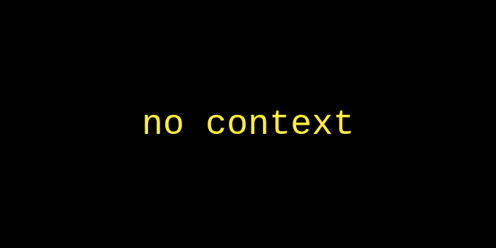

# CommandContext



Every command handler receives a `&CommandContext` as its only argument. It contains everything
vecli parsed from the command line for that invocation.

```rust
fn my_command(ctx: &CommandContext) {
    // ctx is yours to use
}
```

## Fields

### `ctx.subcommand`

The name of the command as typed by the user, e.g. `"add"` or `"list"`.

```rust
println!("Running: {}", ctx.subcommand);
```

### `ctx.positionals`

A `Vec<String>` of all non-flag tokens that followed the subcommand, in order.

```sh
mytool add "buy milk" groceries
# ctx.positionals == ["buy milk", "groceries"]
```

```rust
let task = ctx.positionals.first().map(String::as_str).unwrap_or("unnamed");
```

### `ctx.flags`

A `HashMap<String, String>` of all flags passed by the user, keyed by canonical name after alias
resolution. Boolean flags (no explicit value) have the value `"true"`.

```sh
mytool add "buy milk" --priority high -v
# ctx.flags == { "priority": "high", "verbose": "true" }
```

```rust
if ctx.flags.contains_key("verbose") {
    println!("verbose mode");
}

let priority = ctx.flags.get("priority").map(String::as_str).unwrap_or("medium");
```

Global flags registered on the app are merged in automatically — no extra setup needed in the handler.

## Full Example

```rust
fn add(ctx: &CommandContext) {
    let task = ctx.positionals.first().map(String::as_str).unwrap_or("unnamed");
    let priority = ctx.flags.get("priority").map(String::as_str).unwrap_or("medium");

    if ctx.flags.contains_key("verbose") {
        println!(
            "[verbose] subcommand='{}', positionals={:?}, flags={:?}",
            ctx.subcommand, ctx.positionals, ctx.flags
        );
    }

    println!("Added '{}' with priority {}.", task, priority);
}
```

---

Now our app is looking a bit dry, it only accepts commands with no further elaboration.
Interact with the user using the [Terminal](../terminal/terminal.md), a collection of interactive terminal prompt utilities.

