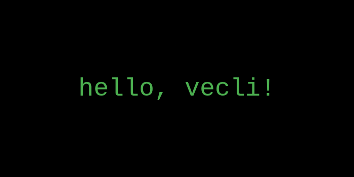

# First App



> [!IMPORTANT]
> This guide documentation is a work in progress. Pages are missing. Expect only the bare minimum to know about using vecli.

Let's build our first app using vecli. The full program can be found [in this repo's `main.rs` file](https://github.com/razkar-studio/vecli/blob/main/examples/taskr.rs). This is the official, up-to-date source code with full examples that use this library's full features.

To see it for yourself, clone the repo and run `cargo run`.

A minimal working example:

```rust
use vecli::*;

fn main() {
    App::new("my-app")
        .run();
}
```

When you run the app, you should see something like:

```
error: No command provided. Try 'my-app --help'.
```

And when you run `--help` (or `cargo run -- --help`), you should see a usage message like this:

```
Usage: my-app <command> [options]

No commands available. Add some using .add_command()!
```

vecli comes with built-in support for generating help messages and usage information.

Congratulations! You've built your first app with vecli. But this isn't customized yet, so let's configure it.

---

Next up, personalize your app by [Configuring Your App](configuring-your-app.md).
