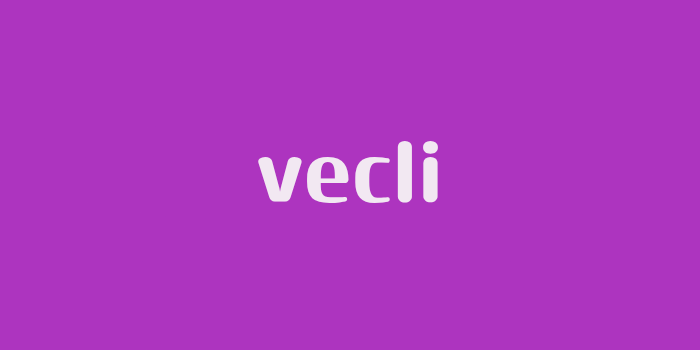

# Introduction

## What Is Vecli?

> [!WARNING]
> vecli is a relatively new crate and is still in development. Expect breaking changes and unstable behavior.

**vecli** *(pronounced vek-lii)* is a zero-dependency CLI (command-line interface) framework that's genuinely readable.
Minimal but powerful, vecli uses a system where CLI commands are the same as in-program functions that take the given command context.

Looking for a minimal CLI framework that compiles almost instantly with zero bloat? Vecli is for you.
No? If your app is **that** important, use `clap` or something.

That being said, you navigated to the user guide because you wanted something, so let's start!
