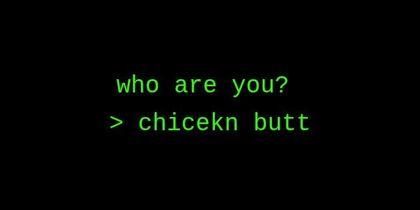
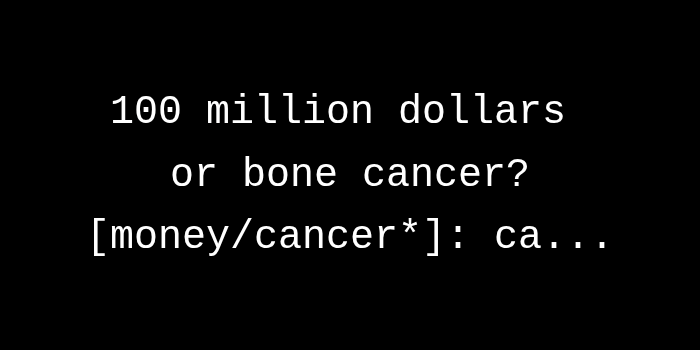

# Terminal & Prompting

Let's say we want to ask the user for confirmation whenever they run the `goodbye` command by a sincere
please telling us not to. We can achieve this using the `Terminal`, a collection of interactive terminal utilities.

## Confirmation

![confirm prompt asking 'do you want to go out with me [Y/y]' responded 'hell no'](../images/do_you_want_to_go_out with_me__[Y_y]__hell_no.png)

We can ask the user for confirmation with the `Confirm` builder pattern like so:

```rust
// use vecli::*;
// ...
Confirm::new("Are you sure you want to say goodbye?").ask();
// or alternatively: Terminal::confirm("Are you sure you want to say goodbye?")
```

This will show a prompt confirming the user about the given prompt, and returns the user's answer as a boolean (yes being true and no otherwise).
By default, Confirm has the default (when the user doesn't give a value) value of `false`. We can change this by configuring the Confirm builder.

### Configuring Confirmation

There's a measly two configuration options for `Confirm`, which is:

* **`.default(b)`**: `false` by default, changes the default choice to the given boolean.
* **`.show_default(b)`**: `true` by default, and if false, will not show the default option beside the prompt.

And if you chose to do it using the manual `Terminal::confirm()` command, here's the order of parameters:

```rust
prompt: &str, 
default: Option<bool>, 
show_default: Option<bool>,
```

Notice `Option` is being used. You'll have to manually wrap the boolean in `Some()`, this is why the builder (`Confirm`)
is much appreciated.

### What It Looks Like

Put the code block above on our previous `goodbye` command, print "Aborted" and return if it evaluates to true.
Running the app with `cargo run hello goodbye` should result in the following:

```sh
$ cargo run hello goodbye
Are you sure you want to say goodbye? [y/N]: y
Hello!
Goodbye!

$ cargo run hello goodbye
Are you sure you want to say goodbye? [y/N]: n # or just enter without giving a value
Aborted
```

## Prompting



Okay, let's get to inputs. We want `hello` to also ask for the name to be displayed, but `Confirm` wouldn't cut it because it's only yes or no.
Well, it *would*, but that would mean spending a bunch of confirm prompts for a finite amount of names. That's just... bad.

We can solve the problem by using `Terminal::prompt()`.

Consider the following:
```rust
// ...
Terminal::prompt("Who do you want to greet?");
```

Notice we don't use spaces at the end, it's because `prompt` automatically suffixes them.

The code block above would return a `String` of whatever the user responds with.

## Choices



For some reason, let's add a new command that asks the user for their favorite fruit.
Add the command [like mentioned before](../core-concepts/commands.md), and we want to give a hard-coded choice of what you think are the best fruit nominees.

> [!NOTE]
> Subjective opinion alert. If you can't handle them, then boohoo.

Now for what I think are the nominees for 'best fruit' are mangoes, watermelons, grapes, and oranges. Maybe I forgot some, I don't know. Submit an issue to the repo or something.

> [!NOTE]
> Like I'd change a page just because of the issue '[insert fruit here] not included in docs'...

We can easily do the task with the `Choice` builder (alternatively the `Terminal::choice()` command):

```rust
// ...
Choice::new("What's the best fruit?", ["mango", "watermelon", "grape", "orange"]).ask();
```

The code above will return the `String` of whatever the user chose.

### Configuring Choices

Let's say you like a fruit on the list so bad, you want to make it the default. Well worry not, there's actually some configuration options for that and more.

* **`.default(&str)`**: Makes the default option the passed `&str`. Panics if the passed argument isn't in one of the options. 
* **`.show_default(bool)`**: `true` by default. If true, shows the default value by marking it with an asterisk (`*`). Else, don't mark it.
* **`.show_choices(bool)`**: `true` by default. If false, not show any choices at all. Not recommended unless you intend to have a choice-showing interface of your own.

### The Code

Let's use the `"mango"` option as an example. The full block would be:

```rust
// ...
Choice::new("What's the best fruit?", ["mango", "watermelon", "grape", "orange"])
    .default("mango")
    .show_default(true) // default is true anyway,
    .show_choices(true) // but just for the sake of showing.
```

A few possibilities for this feature could be a quiz of some sort. I don't know, make something awesome with vecli!

